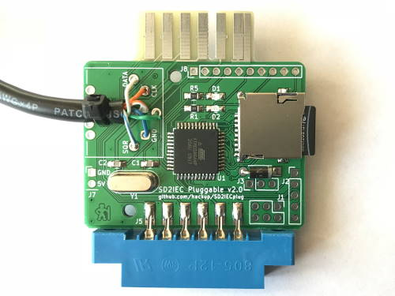
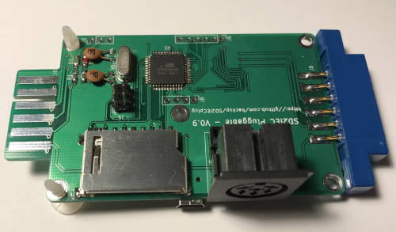

SD2IEC Pluggable
================

* KiCAD project files for my take on a [SD2IEC](http://www.pitsch.de/stuff/mmc2iec/) compatible board.
* The schematics are heavily based on the [design by Shadowolf](https://www.forum64.de/index.php?thread/21242-sd2iec-hardware-1-0/).
* The [BOM export](SD2IECplug-BOM.csv) is included in the repository.
* There should probably be more documentation here, but while it is still missing you may find some additional information [on my blog](https://www.hackup.net/tag/sd2iec/).
* This is all work in progress with absolutely no guarantees. **USE AT YOUR OWN RISK!**

### Revision 2

In revision 2, the PCB size has been reduced by more than 50% and TAPuino support has been ditched. It now features a Micro SD slot and a few other improvements. Note: In this revision, the numbering of the LEDs has been accidentally reversed. This has been fixed later on the master branch.

### Revision 1

The first revision required a much larger PCB but featured a full-size SD slot and experimental support for TAPuino functionality. The latter was never tested though and probably wouldn't work.

If you don't intend to use the TAPuino functionality (and there isn't any firmware support for this yet) you can omit R16-R21 and the optocoupler U3. Also, the board can be power either through the USB or the tape port connector so you don't necessarily need to fit both.

## License

This work is licensed under a
[Creative Commons Attribution-NonCommercial-ShareAlike 4.0 International License](http://creativecommons.org/licenses/by-nc-sa/4.0/).
